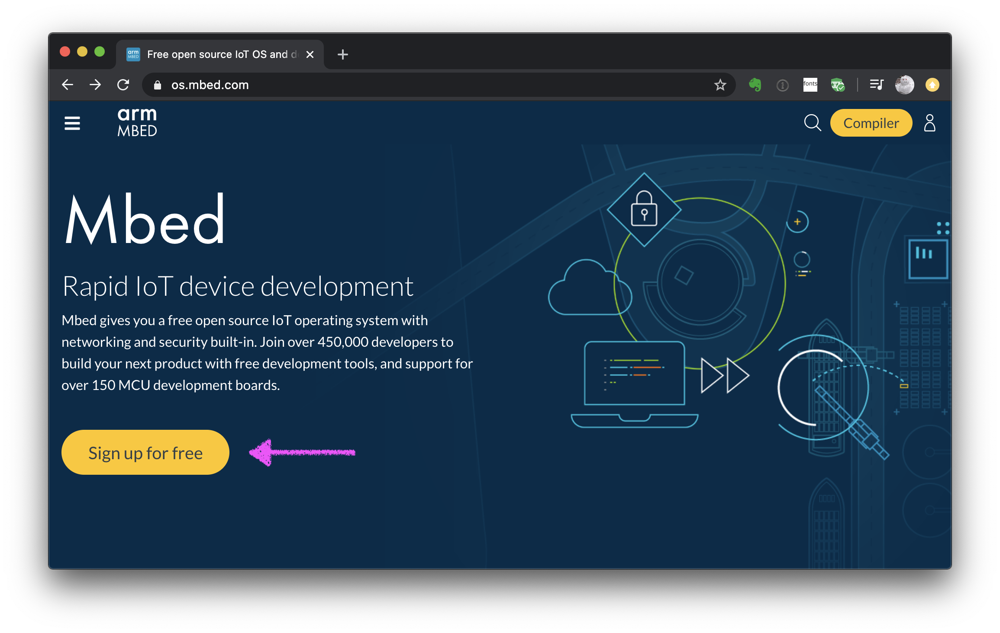

# Mbed開発サイトのアカウント作成方法

このドキュメントでは、ArmMbed開発サイトのアカウント作成方法を説明します。

## 登録ページを開く

https://www.mbed.com/en/ ページにアクセスします。  
以下の`Create an Mbed Account to Get Started`をクリックします。

画面が切り替わるので、以下の`Sign up`をクリックします。

## アカウントを登録する

以下の画面が表示されます。

Email address : emailアドレスを入力します。  
Username : Mbed開発サイトで使用する任意のユーザー名を入力します（英数字を使ってください）。  
Password : ログイン時のパスワードを入力します。  
First name : 名前を入力します。  
Last name : 名字を入力します。  
Contry : Japan と入力してください。  

最後に`Sign up`ボタンを押すと登録が完了します。
